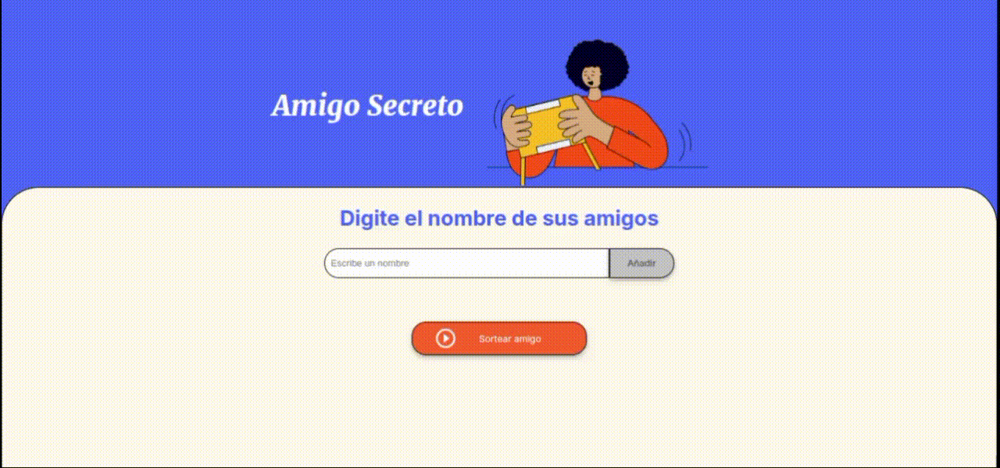

# Amigo Secreto 🎉

¡Bienvenido al proyecto **Amigo Secreto**! Este proyecto es un desafío de Alura Latam que tiene como objetivo fortalecer las habilidades en lógica de programación. Aquí podrás agregar los nombres de tus amigos y sortear un amigo secreto de manera aleatoria.

## Descripción del Proyecto 📋

El proyecto consiste en una página web que permite crear una lista de amigos. A medida que se añaden nuevos amigos, esta lista se actualiza automáticamente. Además, los usuarios pueden determinar quién será su amigo secreto utilizando el botón "Sortear amigo".

## Funcionalidades 🔧

### Agregar Amigo

- Ingresa el nombre de un amigo en el campo de texto.
- Haz clic en el botón "Añadir" para agregar el nombre a la lista.

### Sortear Amigo

- Haz clic en el botón "Sortear amigo" para seleccionar un nombre al azar de la lista.
- El nombre sorteado se mostrará en la sección de resultados.

## Demostración 📸

## Tecnologías Utilizadas 🛠️

- HTML5
- CSS3
- JavaScript

---

¡Diviértete sorteando a tu amigo secreto! 🎁